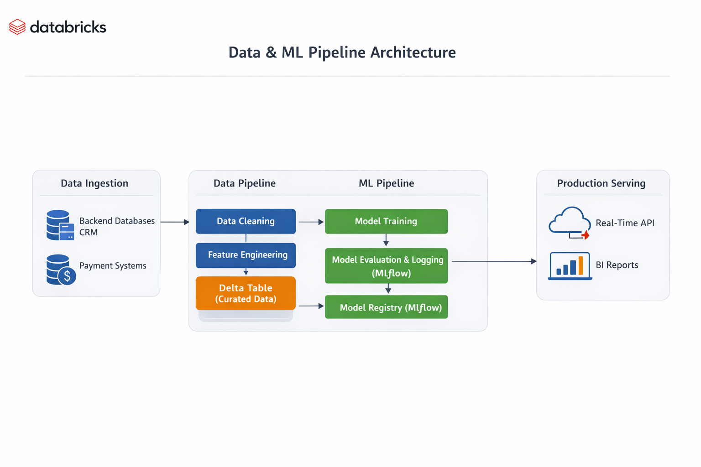

## 📌 Project Overview

This project demonstrates a complete **Data Engineering + Machine Learning pipeline** built using Databricks.

---

## 🏗 Architecture

Below is the high-level architecture of the integrated Data + ML pipeline:

  

### 🔄 Pipeline Flow

Raw Data
⬇
Bronze Layer (Raw Delta Table)
⬇
Silver Layer (Cleaned & Transformed Data)
⬇
Gold Layer (Feature Engineered Data)
⬇
ML Training Pipeline
⬇
MLflow Tracking
⬇
Unity Catalog Model Registry
⬇
Model Serving Endpoint

---

## 🛠 Technologies Used

* Databricks
* PySpark
* Delta Lake
* MLflow
* Unity Catalog
* Databricks Model Serving

---

## 📊 Feature Engineering

* `amount = quantity × unitPrice`
* `high_value_label = 1 if amount > 5000 else 0`

---

## 🚀 Deployment

Model deployed using:
Databricks Serverless Model Serving (Scale-to-Zero enabled)

---

